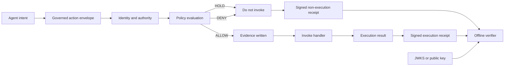

# OAECP Public Release Review and Usage Guide

## Release identity

- **Repository:** https://github.com/Strixgov/open-agent-execution-control
- **Draft tag:** `v0.1.0-draft`
- **Pinned commit:** `577b391d98fb9d2d90b150617818cacd90507f9a`
- **License:** Apache-2.0
- **Status:** Public draft and tested reference implementation
- **Not claimed:** adopted standard, external certification, or complete production integration

## Executive assessment

OAECP is a public draft profile and reference implementation for controlling consequential AI-agent actions immediately before they invoke a real side-effect handler.

The release converts Strix Gov's execution-control thesis into something public, inspectable, runnable, and falsifiable. It demonstrates a tested subset of the intended control contract and includes public schemas, key material, receipts, tests, verifier code, and documentation.

The accurate framing is:

> The draft specifies the intended control contract; the reference implementation demonstrates a tested subset.

## Architecture



OAECP separates:

- intent;
- identity;
- delegated authority;
- policy evaluation;
- decision;
- approval;
- execution;
- evidence;
- cryptographic proof.

This separation is central to the trust model. A policy decision is not treated as execution proof, and execution proof is not inferred from a dashboard assertion.

## Demonstrated behavior

| Action | Decision | Handler invoked? | Receipt |
|---|---:|---:|---:|
| Inspect repository | `ALLOW` | Yes | Signed |
| Propose patch | `ALLOW` | Yes | Signed |
| Merge to production | `HOLD` | No | Signed |
| Rotate credentials | `DENY` | No | Signed |

Only `inspect` and `patch` appear in the executor-call record.

## Major features

### Governed action envelope

The envelope standardizes:

- agent identity;
- capability ID;
- requested action;
- resource scope;
- risk;
- tenant and environment;
- payload hash;
- delegation chain;
- approval reference;
- idempotency key.

### Point-of-use enforcement

The reference implementation demonstrates that it can:

- verify that a capability was delegated;
- hold approval-dependent actions;
- deny undelegated actions;
- consume a scope-bound approval once;
- reject approval replay;
- suppress duplicate execution;
- reject idempotency-key rebinding;
- prevent held and denied handlers from running;
- sign successful, failed, held, and denied outcomes.

### Independent proof

The verifier checks:

- profile version;
- record hash;
- Ed25519 signature;
- JWKS key ID;
- authority binding;
- policy status;
- decision/execution consistency;
- receipt-chain continuity;
- overall validity.

The published verifier does not require a Strix account.

## Use categories

### Secure software delivery

- Allow patch proposals while holding production merges.
- Permit staging deployment while denying production deployment.
- Draft vulnerability disclosures while preventing premature publication.

### Enterprise operations

- Send communications only to an approved cohort.
- Permit credential inspection while holding rotation or revocation.
- Allow low-risk record updates while protecting bulk or regulated changes.

### Financial and commercial workflows

- Enforce refund amount and transaction-count limits.
- Permit purchase preparation while holding final financial commitment.
- Allow pricing analysis while blocking unapproved publication.

These are architectural possibilities, not claims of current financial certification.

### Agent and tool integration

- Govern ordinary Python functions.
- Intercept MCP `callTool` requests.
- Place a control boundary before REST, LangChain, or NVIDIA NOOA tool calls.

The adapter contract exists, but framework-specific adapters are not included in `v0.1.0-draft`.

### Audit and assurance

- Attach signed authorization evidence to deployments or administrative changes.
- Reconstruct which actions were requested, blocked, attempted, failed, or completed.
- Let third parties verify published receipts without access to the enforcement platform.

### Standards and procurement

- Provide a concrete contribution for Alliance and OpenSSF discussion.
- Compare agent systems using consistent execution-control requirements.
- Express procurement requirements for pre-invocation enforcement and portable proof.

## Reproduction

```bash
git clone https://github.com/Strixgov/open-agent-execution-control.git
cd open-agent-execution-control
git checkout v0.1.0-draft
python -m pip install --requirement requirements.txt
python run_conformance.py
```

Expected high-level result:

```text
Ran 16 tests
OK
executor_calls: ["inspect", "patch"]
all four receipts: valid
aggregate verification: valid
```

Verify the published bundle separately:

```bash
python -m reference.verify_all
```

A reproduction report should capture:

- operating system;
- Python version;
- commit SHA;
- dependency versions;
- complete command output;
- whether the proof bundle verified;
- any discrepancies.

## Verification limitations

The following gaps must remain publicly disclosed:

- The serializer is deterministic for the demo but is not a complete RFC 8785 implementation.
- The published JSON Schemas are not enforced by the Python verifier.
- Duplicate JSON keys are not rejected.
- Key validity periods and revocation are not evaluated.
- Predecessor chain verification compares stored hashes but does not fully revalidate the predecessor inside the same operation.

These gaps mean the implementation should not yet be described as fully conformant with every normative statement in the draft.

## Production-hardening limitations

- Approval consumption is in memory, not durably atomic.
- Idempotency state is not persistent.
- Receipt chaining is held in process memory.
- Demo signing keys are not managed through KMS or HSM infrastructure.
- Identity is supplied by the demo instead of authenticated transport.
- The policy engine is illustrative and hard-coded.
- No network boundary prevents direct calls around the Python wrapper.
- Crash recovery and executor-success/receipt-failure reconciliation are incomplete.
- Concurrency and tenant isolation are not demonstrated.

The implementation is therefore a reference and conformance-development surface, not a production authorization service.

## Threat boundaries and non-goals

OAECP does not by itself prove that:

- an agent is aligned or safe;
- a model output is factually correct;
- an executor cannot be reached through another ungoverned path;
- the signing host is uncompromised;
- a published receipt contains no sensitive information;
- a deployment is compliant with a law or certification framework;
- every adapter preserves the intended enforcement boundary.

Production deployments must independently secure identity, network paths, secrets, key custody, storage, transactionality, and operational response.

## Recommended public claim

> Strix Gov has published OAECP v0.1.0-draft, a tested open reference implementation for point-of-action agent authorization and independently verifiable execution receipts. The demonstration allows repository analysis and patch proposal, holds production merge for approval, denies undelegated credential rotation, and produces an Ed25519-signed receipt for every outcome. The public verifier reproduces the four-record result offline. OAECP is a draft contribution—not an adopted standard, external certification, or complete production integration.

## Claims to avoid

Do not state that:

- OAECP is an industry standard;
- the Alliance, OpenSSF, or Akrites has adopted or endorsed it;
- the implementation is production hardened;
- the verifier fully implements RFC 8785;
- all adapters described by the profile are shipped;
- a third party has independently reproduced it unless a documented reproduction exists;
- the demonstration proves cybersecurity safety beyond the published action and receipt semantics.

## Roadmap

### Version 0.1.1 — verifier correctness

- Full RFC 8785 implementation
- Duplicate-key rejection
- Runtime JSON Schema validation
- Complete predecessor validation
- Key validity and revocation
- Unicode and numeric golden vectors

### Version 0.2 — durable enforcement

- Persistent approval-token consumption
- Durable idempotency
- Transactional evidence and receipt persistence
- Crash-recovery tests
- Concurrency testing
- Tenant isolation
- Protected executor boundary

### Version 0.3 — integration

- Python decorator
- MCP adapter
- REST middleware
- LangChain adapter
- NVIDIA NOOA adapter
- Shared adapter conformance harness

## FAQ

### Is OAECP an adopted standard?

No. It is a public draft profile and reference implementation proposed for technical discussion and contribution.

### Is the reference implementation production ready?

No. It demonstrates a tested subset and intentionally discloses durability, identity, key-management, schema-validation, and boundary-protection gaps.

### Does a `DENY` receipt prove that no action occurred anywhere?

It proves the published OAECP-controlled handler was recorded as not invoked under the demonstrated boundary. It does not prove that no ungoverned path or external system performed a similar action.

### Why sign `HOLD` and `DENY` outcomes?

A signed non-execution receipt allows a verifier to distinguish a deliberate policy result from a missing log or absent record.

### Can OAECP work with open and closed models?

The profile is model-neutral. It governs the requested side effect, not the internal model architecture.

### Does the verifier require Strix?

No. The published reference verifier uses the receipt, canonicalization rules, and public verification key material.

### Are the financial examples certified use cases?

No. They are architectural possibilities and must not be presented as regulatory or financial certification claims.

### What is the next credibility milestone?

Close the verifier-correctness gaps, publish a formal GitHub Release, ship one concrete framework adapter, and obtain a documented third-party reproduction.

## Release decision

`v0.1.0-draft` is suitable for publication and ecosystem outreach as:

- a public draft profile;
- a tested reference implementation;
- a reproducible demonstration;
- a falsifiable execution-control claim;
- an open contribution proposal.

It is not approved as:

- a fully conformant implementation;
- a production authorization system;
- an external certification;
- an adopted industry standard.
